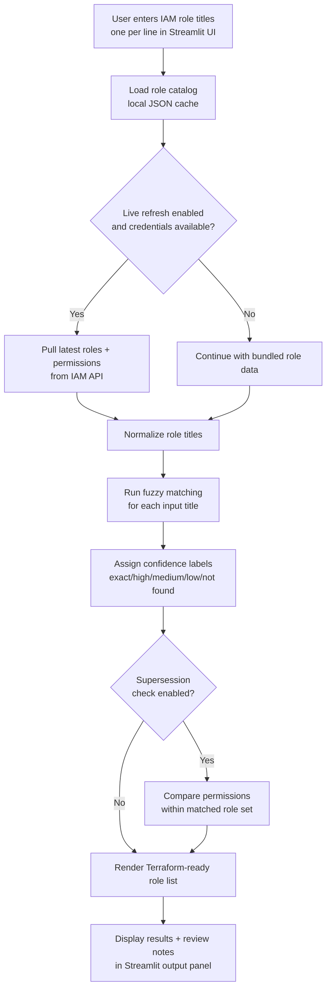

# GCP Role Lookup

A Streamlit application that converts **human-readable GCP IAM role titles** (for example, `BigQuery Data Editor`) into canonical **role IDs** (for example, `roles/bigquery.dataEditor`) and renders Terraform-friendly output.

The app supports:
- Fuzzy matching for near matches
- Review guidance when matches are ambiguous
- Optional supersession detection using role permissions
- Local/offline use with bundled role data
- Live refresh from the IAM API when credentials are available

---

## Table of Contents

- [What This Tool Does](#what-this-tool-does)
- [Repository Layout](#repository-layout)
- [Prerequisites](#prerequisites)
- [Authentication for Live Refresh](#authentication-for-live-refresh)
- [Run on Windows](#run-on-windows)
- [Run on Linux/macOS](#run-on-linuxmacos)
- [Run in a Container (Podman or Docker)](#run-in-a-container-podman-or-docker)
- [Refresh Role and Permission Data](#refresh-role-and-permission-data)
- [How Matching Works](#how-matching-works)
- [Supersession Detection](#supersession-detection)
- [Troubleshooting](#troubleshooting)

---

## What This Tool Does

Input a list of role titles (one per line), then the app:

1. Resolves each title to the best matching GCP role ID.
2. Labels each match by confidence (exact/high/medium/low/not found).
3. Produces Terraform HCL-style output suitable for IAM role lists.
4. Optionally comments out roles that are superseded by broader roles in the same batch.

### Application Flow



---

## Repository Layout

```text
gcp-role-lookup/
├── app/
│   ├── main.py                # Streamlit app entry point
│   ├── matcher.py             # Fuzzy matching logic
│   ├── formatter.py           # Terraform/HCL output formatting
│   ├── role_loader.py         # Local cache loading + optional API refresh
│   └── supersession.py        # Permission subset/supersession checks
├── scripts/
│   └── refresh_roles.py       # Refreshes roles + permissions via IAM API
├── data/
│   ├── gcp_roles.json         # Role title/name cache used by app
│   └── role_permissions.json  # Permission map used for supersession checks
├── setup_windows.ps1          # Windows helper setup script
├── setup_linux.sh             # Linux/macOS helper setup script
├── requirements.txt
├── ContainerFile              # Podman/Docker build file
└── README.md
```

---

## Prerequisites

### Required for normal app usage

- **Python 3.12+**
- **pip**

### Required only for data refresh (`scripts/refresh_roles.py`)

- **gcloud CLI**
- Authenticated credentials that can call IAM roles APIs

### Verify prerequisites

```bash
python --version
pip --version
gcloud --version
```

If `gcloud` is missing, install it from: <https://cloud.google.com/sdk/docs/install>

---

## Authentication for Live Refresh

You only need authentication when you refresh role/permission data from GCP.

### Recommended: Application Default Credentials (ADC)

```bash
gcloud auth application-default login
```

Default ADC file locations:
- **Windows**: `%APPDATA%\gcloud\application_default_credentials.json`
- **Linux/macOS**: `~/.config/gcloud/application_default_credentials.json`

### Optional: Explicit credentials path

Set `GOOGLE_APPLICATION_CREDENTIALS` to a service-account JSON key path.

**PowerShell (Windows):**
```powershell
$env:GOOGLE_APPLICATION_CREDENTIALS = "C:\path\to\service-account-key.json"
```

**Command Prompt (Windows):**
```cmd
set GOOGLE_APPLICATION_CREDENTIALS=C:\path\to\service-account-key.json
```

**bash (Linux/macOS):**
```bash
export GOOGLE_APPLICATION_CREDENTIALS=/path/to/service-account-key.json
```

---

## Run on Windows

### Option A (recommended): helper script

From PowerShell in the repository root:

```powershell
.\setup_windows.ps1
```

What this script does:
- Checks Python 3.12+
- Checks `gcloud` (unless skipped)
- Offers optional ADC login at the start (for live refresh only)
- Creates `.venv` and installs dependencies
- Starts Streamlit automatically

If PowerShell blocks script execution:

```powershell
Set-ExecutionPolicy -ExecutionPolicy RemoteSigned -Scope CurrentUser
```

Optional flags:

```powershell
.\setup_windows.ps1 -SkipGcloud
.\setup_windows.ps1 -SkipVenv
```

### Option B: manual setup

```powershell
python -m venv .venv
.\.venv\Scripts\Activate.ps1
pip install -r requirements.txt
streamlit run app/main.py
```

App URL: <http://localhost:8501>

---

## Run on Linux/macOS

### Option A (recommended): helper script

```bash
chmod +x setup_linux.sh
./setup_linux.sh
```

What this script does:
- Checks Python 3.12+
- Checks `gcloud` (unless skipped)
- Offers optional ADC login at the start (for live refresh only)
- Creates/activates `.venv` and installs dependencies
- Starts Streamlit automatically

Optional flags:

```bash
./setup_linux.sh --skip-gcloud
./setup_linux.sh --skip-venv
```

### Option B: manual setup

```bash
python3 -m venv .venv
source .venv/bin/activate
pip install -r requirements.txt
streamlit run app/main.py
```

App URL: <http://localhost:8501>

---

## Run in a Container (Podman or Docker)

> The repository uses a build file named `ContainerFile` (capital **F**). Use `-f ContainerFile` explicitly.

### Build image

**Podman:**
```bash
podman build -f ContainerFile -t gcp-role-lookup .
```

**Docker:**
```bash
docker build -f ContainerFile -t gcp-role-lookup .
```

### Run with bundled static data (no live refresh credentials)

**Podman:**
```bash
podman run --rm -p 8501:8501 gcp-role-lookup
```

**Docker:**
```bash
docker run --rm -p 8501:8501 gcp-role-lookup
```

Open: <http://localhost:8501>

### Run with ADC mounted (enable live refresh in UI)

#### Linux/macOS host

**Podman:**
```bash
podman run --rm -p 8501:8501 \
  -v "$HOME/.config/gcloud:/home/appuser/.config/gcloud:ro" \
  -e GOOGLE_APPLICATION_CREDENTIALS=/home/appuser/.config/gcloud/application_default_credentials.json \
  gcp-role-lookup
```

**Docker:**
```bash
docker run --rm -p 8501:8501 \
  -v "$HOME/.config/gcloud:/home/appuser/.config/gcloud:ro" \
  -e GOOGLE_APPLICATION_CREDENTIALS=/home/appuser/.config/gcloud/application_default_credentials.json \
  gcp-role-lookup
```

#### Windows host (PowerShell)

```powershell
docker run --rm -p 8501:8501 `
  -v "$env:APPDATA\gcloud:/home/appuser/.config/gcloud:ro" `
  -e GOOGLE_APPLICATION_CREDENTIALS=/home/appuser/.config/gcloud/application_default_credentials.json `
  gcp-role-lookup
```

You can replace `docker` with `podman` if preferred.

---

## Refresh Role and Permission Data

Run this from the repository root.

**Windows:**
```powershell
python scripts/refresh_roles.py
```

**Linux/macOS:**
```bash
python3 scripts/refresh_roles.py
```

What it updates:
- `data/gcp_roles.json`
- `data/role_permissions.json`

Expected requirements:
- `gcloud` installed and authenticated
- Identity allowed to call IAM roles API (`iam.roles.list`)

---

## How Matching Works

Confidence levels used by the matcher:

| Score Range | Status    | Output behavior |
|---|---|---|
| 100 | Exact | Included as normal |
| 85–99 | High | Included with inline warning comment |
| 60–84 | Medium | Included with inline warning comment |
| <60 | Low | Commented out, review required |
| no candidate | Not found | Commented out, review required |

---

## Supersession Detection

If permission data is available (`data/role_permissions.json`), the app checks whether one selected role is a strict subset of another selected role.

When superseded, the narrower role is commented out in output, for example:

```hcl
# "roles/bigquery.dataEditor", # BigQuery Data Editor [Superseded by roles/bigquery.admin]
"roles/bigquery.admin", # BigQuery Admin
```

If permission data is missing, the app still works but skips supersession checks.

---

## Troubleshooting

### `gcloud CLI not found in PATH`

Install: <https://cloud.google.com/sdk/docs/install>

Then verify:

```bash
gcloud --version
```

### Authentication errors (`No ADC found`, `ADC authentication failed`, `Unauthorized 401`, `Forbidden 403`)

Run:

```bash
gcloud auth application-default login
```

Then verify account context:

```bash
gcloud auth list
```

If using service-account keys, confirm `GOOGLE_APPLICATION_CREDENTIALS` points to a real file.

### `role_permissions.json not found` warning

This means supersession detection is disabled. Refresh data:

```bash
python scripts/refresh_roles.py
```

### Streamlit does not start

Reinstall dependencies in your active environment:

```bash
pip install -r requirements.txt
streamlit run app/main.py
```

### Port `8501` already in use

Run Streamlit on another port:

```bash
streamlit run app/main.py --server.port 8502
```

---

## Notes

- The app can be used **offline** with the checked-in role cache.
- Live refresh requires network access to Google APIs and valid credentials.
- Container runtime does not include the gcloud CLI; mount credentials if using the in-app refresh.
